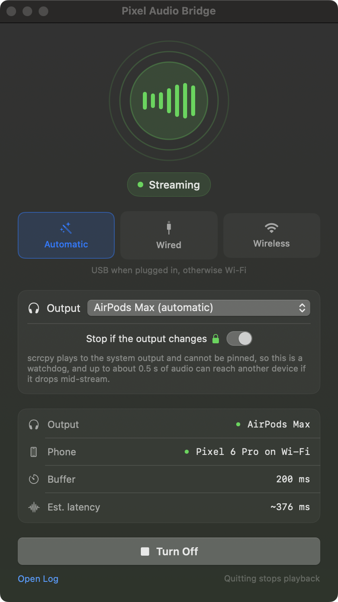

<div align="center">


<h1>Pixel Audio Bridge</h1>

<p><strong>Hear your phone through your Mac's headphones.</strong><br>
<sub>Put them on and it starts by itself. Take them off and it stops.</sub></p>

[](https://github.com/nicglazkov/pixel-audio-bridge/actions/workflows/build.yml)
[](LICENSE)
[](#what-you-need)
[](https://nicglazkov.github.io/pixel-audio-bridge/#latency)
[](tests)

<br>



</div>

---

Most good headphones hold one Bluetooth connection at a time, so using them with
your phone means unpairing them from your Mac and pairing them back afterwards.

You cannot fix that with Bluetooth. **macOS has no A2DP sink**, so a Mac can never
appear in a phone's output list as a speaker. This moves the audio instead: over
USB or your own network, out of whatever your Mac is already playing to.

## What you need

|  |  |  |
|---|---|---|
| **Mac** | macOS 14+ | Apple silicon or Intel |
| **Phone** | Android 11+ | USB debugging enabled |
| **Output** | Any device | Headphones, a USB DAC, or speakers |
| **Tools** | `scrcpy` and `adb` | Both free, both on Homebrew |

## Quick start

```sh
brew install scrcpy
git clone https://github.com/nicglazkov/pixel-audio-bridge.git
cd pixel-audio-bridge && ./build.sh
open build/PixelAudioBridge.app
```

Plug the phone in and accept the debugging prompt. For wireless, run
`./bin/pab enable-wireless` once while it is plugged in.

You build it yourself, so there is nothing to notarize and no Gatekeeper prompt.

## How it reacts

| When | It does |
|---|---|
| You put your headphones on | Starts by itself, within about a second |
| You take them off | Goes quiet and waits, then resumes when they return |
| You unplug the cable | Moves to Wi-Fi and widens the buffer |
| Your Mac's output changes | **Halts instead of following it** |
| You quit the app | Tears down every child process |

Closing the window does not stop playback. The app lives in the menu bar.

## Latency

| Link | Buffer | Bluetooth | Total |
|---|---|---|---|
| **Wired, USB** | 15 ms | 170.7 ms | **191 ms** |
| **Wireless, Wi-Fi** | 200 ms | 170.7 ms | **376 ms** |

The Bluetooth figure is identical in both because it happens inside the
headphones. It is 89% of the wired budget and nothing on either machine changes
it, so everything this software controls is the twenty milliseconds beside it.

Measured with AirPods Max. A wired output device skips that stage almost
entirely. [How each number was measured](https://nicglazkov.github.io/pixel-audio-bridge/how-it-works.html#measurements)

## Commands

```sh
pab run [--wired|--wireless] [--buffer MS] [--device UID] [--serial S]
pab stop | status | info | doctor | enable-wireless
```

`pab doctor` reports dependencies, devices, transports and config in one pass.
Start there when something is wrong.

## Documentation

| | |
|---|---|
| [**How it works**](https://nicglazkov.github.io/pixel-audio-bridge/how-it-works.html) | The internals, the watchdog, and how every number was measured |
| [**Troubleshooting**](https://nicglazkov.github.io/pixel-audio-bridge/troubleshooting.html) | No sound, clicks, wireless resets, and the rest |
| [**Privacy**](https://nicglazkov.github.io/pixel-audio-bridge/privacy.html) | What is stored, and what leaves your machine. Nothing does |
| [**Security**](https://nicglazkov.github.io/pixel-audio-bridge/security.html) | Threat model, accepted risks, and how to report a vulnerability |
| [**Contributing**](CONTRIBUTING.md) | Layout, tests, and what will get pushed back on |

## Limitations

- Phone calls cannot be captured. Android blocks it, and there is no mic path back.
- Some apps opt out of audio capture and will be silent. Spotify does; Instagram does not.
- Video on the phone leads the audio, because the phone cannot know to compensate.
- The output watchdog takes up to about half a second, so it is not a hard guarantee.

## Tests

```sh
./tests/run.sh
```

78 tests, none needing a phone, headphones or any audio hardware.

## Built with

[scrcpy](https://github.com/Genymobile/scrcpy) does the capture and playback, and
this would not exist without it. See [NOTICE](NOTICE) for attribution.

MIT licensed. See [LICENSE](LICENSE).
